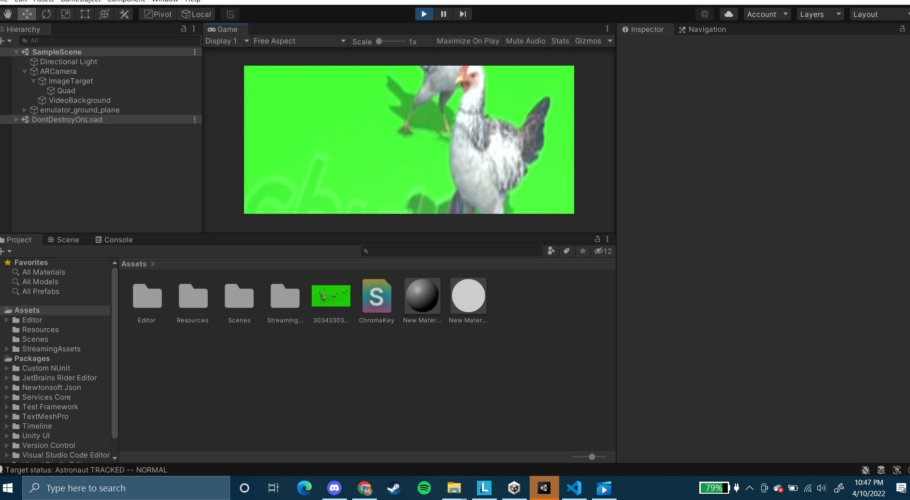

# Traditional AR project with transparent video

**Present project shows the use of AI with transparent video**

### **Description**
This is project was created as a part of the course "Introduction to AR/VR Application Development" course. The project demonstrates a simple usage of a web AR or traditional AR project that has a transpatent video created using ML. It consists of the following:
- readme.md (markdown file)
- sample.glb (3D model)
- Android application with transparent video (chroma key) 

### **Project Screenshots**
Screenshot of the project.

### **Author**
The author of the project: MJ Beatty